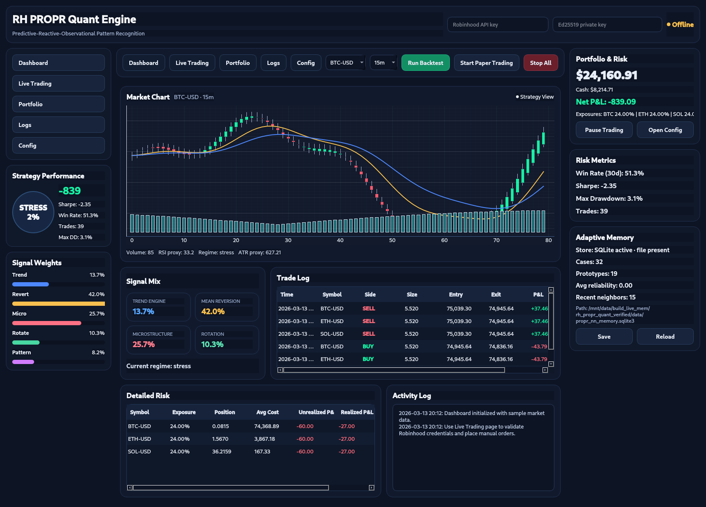
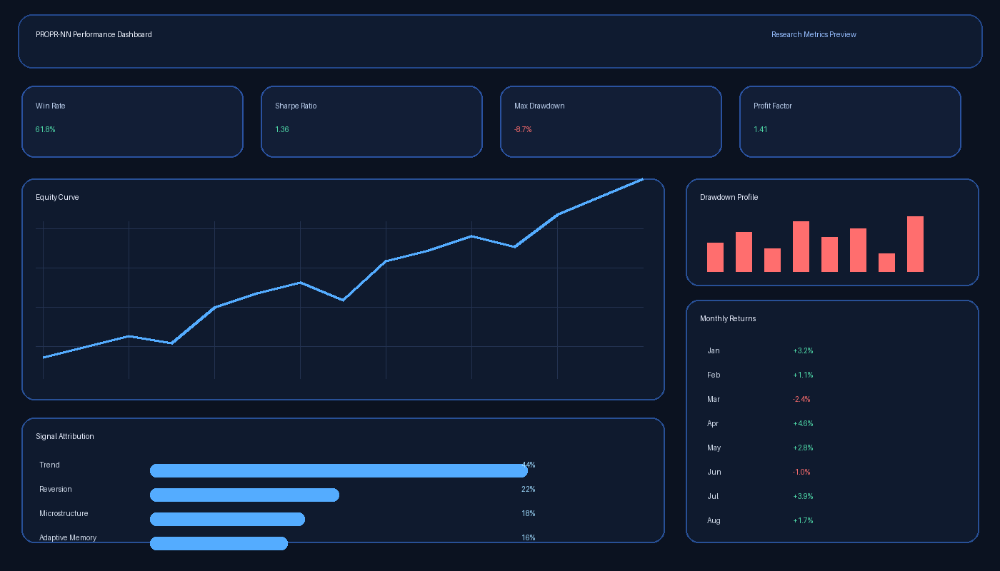
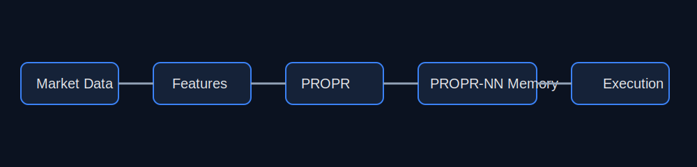

# PROPR-NN Adaptive Crypto Trading Engine 🚀

Adaptive **Python** trading engine for cryptocurrency markets using **Predictive-Reactive-Observational Pattern Recognition (PROPR)** and a self-reinforcing nearest-neighbor learning system (**PROPR-NN**).






---

## 📋 Table of contents

- [Overview](#overview)
- [Why this project exists](#why-this-project-exists)
- [Architecture](#architecture)
- [Supported exchanges](#supported-exchanges)
- [Adaptive memory engine](#adaptive-memory-engine)
- [Quick start](#quick-start)
- [Installation](#installation)
- [Features](#features)
- [Project layout](#project-layout)
- [Disclaimer](#disclaimer)
- [License](#license)

---

## Overview

This project is a **Python-based adaptive crypto trading workstation** built around:

- predictive signal generation
- reactive risk controls
- observational pattern recognition
- adaptive nearest-neighbor learning
- persistent SQLite memory
- paper trading and supervised live-trading workflows
- a desktop GUI for research and execution

The goal is to create a system that behaves **AI-like** without relying on deep learning.

---

## Why this project exists

Most trading bots depend on static indicators or fixed rules. This project takes a different approach:

- store historical market states
- retrieve similar prior states
- reinforce actions that worked
- decay stale market memories
- compress recurring patterns into prototypes

That produces a more adaptive system that can evolve as market behavior changes.

---

## Architecture



```text
Market Data → Feature Encoder → PROPR Signals → PROPR-NN Memory → Risk Management → Execution
```

---

## Supported exchanges

| Exchange | Status | Features |
|----------|--------|----------|
| Bitstamp | 🔄 In Development | Spot trading, market data |

> Exchange connectivity is still under active development and should be verified locally before live use.

---

## Adaptive memory engine

The PROPR-NN system stores historical market states and uses similarity-based retrieval to guide future decisions.

Each memory entry contains:

- state vector
- action taken
- reward outcome
- confidence score
- timestamp
- feature weights

Persistent memory location:

```text
data/propr_nn_memory.sqlite3
```

Implemented memory features:

- **Session warm-start** — reload prior memory on startup
- **Memory decay** — reduce influence of stale states
- **Prototype compression** — merge highly similar cases
- **SQLite persistence** — preserve learning across restarts

---

## Quick start

Clone the repo:

```bash
git clone https://github.com/YOUR_USERNAME/propr-nn-trading-engine.git
cd propr-nn-trading-engine
```

Run with **Python**:

```bash
python -m pip install -r requirements.txt
python app.py
```

---

## Installation

Create a virtual environment and install dependencies:

```bash
python -m venv .venv
```

Activate it:

```bash
# Windows
.venv\Scripts\activate

# Linux / macOS
source .venv/bin/activate
```

Install requirements:

```bash
python -m pip install -r requirements.txt
```

---

## Features

| Feature | Description |
|--------|-------------|
| PROPR signals | Predictive, reactive, and observational market features |
| PROPR-NN learning | Adaptive nearest-neighbor policy memory |
| Persistent memory | SQLite-backed market experience storage |
| Paper trading | Simulated fills, P&L, and portfolio tracking |
| GUI workstation | Desktop interface for research and execution |
| Backtesting | Historical evaluation of strategy behavior |

---

## Project layout

```text
propr-nn-trading-engine/
├── app.py
├── engine/
├── gui/
├── assets/
│   ├── gui_preview.png
│   ├── demo_live_gui.gif
│   ├── performance_dashboard.png
│   └── architecture.svg
├── tests/
├── requirements.txt
└── README.md
```

---

## Disclaimer

This project is for **research and experimentation**. Cryptocurrency trading carries substantial risk. Test thoroughly in paper trading before attempting any live use.

---

## License

MIT
